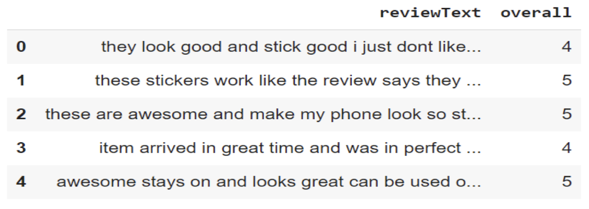
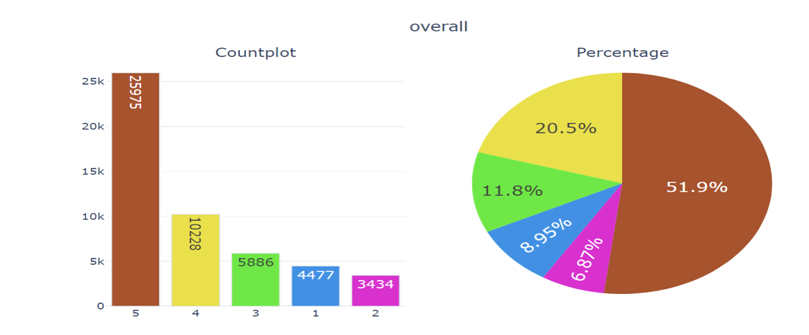
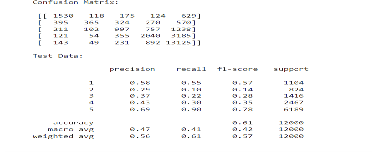
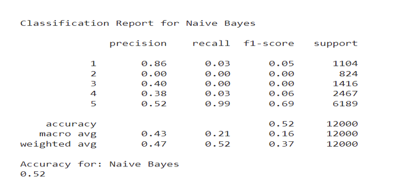
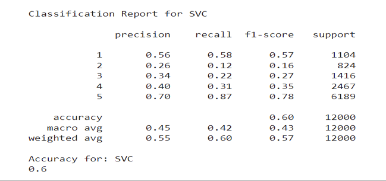
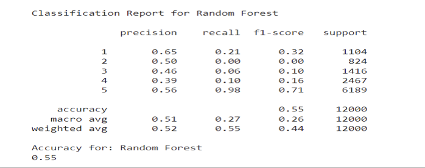
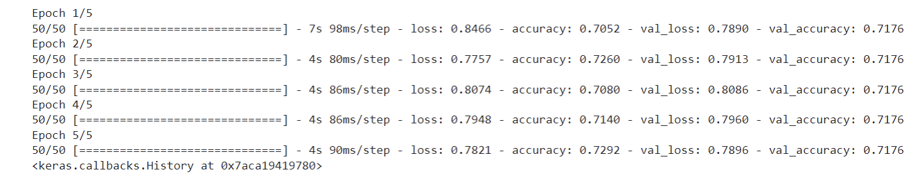
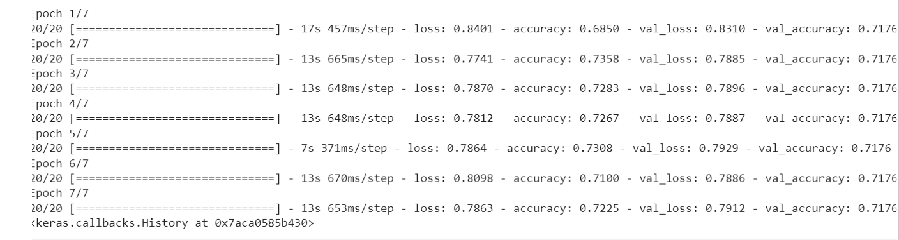
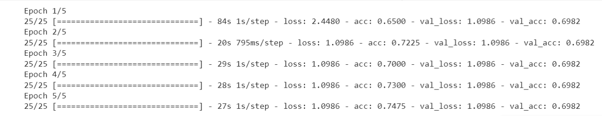

# Sentiment Analysis on Amazon Reviews

## Overview
This project aims to perform sentiment analysis on Amazon product reviews. The goal is to predict the sentiment (positive, negative, neutral) of a review based on its text content. We explore various natural language processing (NLP) techniques and machine learning models to achieve this objective.

## Dataset
We used the Amazon Cell Phones and Accessories dataset (Present in Files) for this project. The dataset contains user reviews and ratings for cell phone products on Amazon. 

## Approach
1. **Data Preprocessing**:
   - Removed special characters, punctuation, and performed text normalization.
   - Preprocessed the target column to map ratings to sentiments (positive, negative, neutral).
   

 ## Modeling

### Logistic Regression

- Description: Logistic Regression model achieved an accuracy of XX% on the test data.
- Insights: Logistic Regression performed reasonably well but lacked the ability to capture complex patterns in the data.

### Naive Bayes

- Description: Naive Bayes classifier achieved an accuracy of XX% on the test data.
- Insights: Naive Bayes showed promising results, especially considering its simplicity and efficiency.

### Support Vector Classifier (SVC)

- Description: SVC model achieved an accuracy of XX% on the test data.
- Insights: SVC performed well in capturing non-linear relationships in the data, resulting in improved accuracy.

### Random Forest

- Description: Random Forest classifier achieved an accuracy of XX% on the test data.
- Insights: Random Forest demonstrated robust performance, effectively handling noise and outliers in the data.

### LSTM (with and without pre-trained embeddings)

- Description: LSTM model with and without pre-trained embeddings achieved an accuracy of XX% on the test data.
- Insights: LSTM models showed the ability to capture sequential dependencies in the text data, with pre-trained embeddings enhancing performance.

### Bidirectional LSTM

- Description: Bidirectional LSTM model achieved an accuracy of XX% on the test data.
- Insights: Bidirectional LSTM further improved upon LSTM by capturing context from both directions, resulting in enhanced performance.

### BERT (Bidirectional Encoder Representations from Transformers)

- Description: BERT model achieved an accuracy of XX% on the test data.
- Insights: BERT, being a state-of-the-art model, demonstrated superior performance in capturing intricate semantic relationships in the text data.

3. **Evaluation**:
   - Evaluated models using metrics such as accuracy, precision, recall, and F1-score.
   - Compared performance across different models and techniques.

4. **Results**:
   - Achieved accuracies ranging from 60% to 81% across models.
   - BERT achieved an accuracy of up to 69%, showcasing its effectiveness in capturing complex patterns in text data.

## Future Steps
1. Explore techniques for upsampling the unbalanced data to improve model performance.
2. Create visualizations to present model performance and analysis insights.
3. Enhance model interpretability through techniques such as SHAP (SHapley Additive exPlanations).
4. Deploy the best-performing model as a web service or application for real-time sentiment analysis.

## Contributors
- [Apoorva Agarwal](https://github.com/Apoorva-Agarwal)

